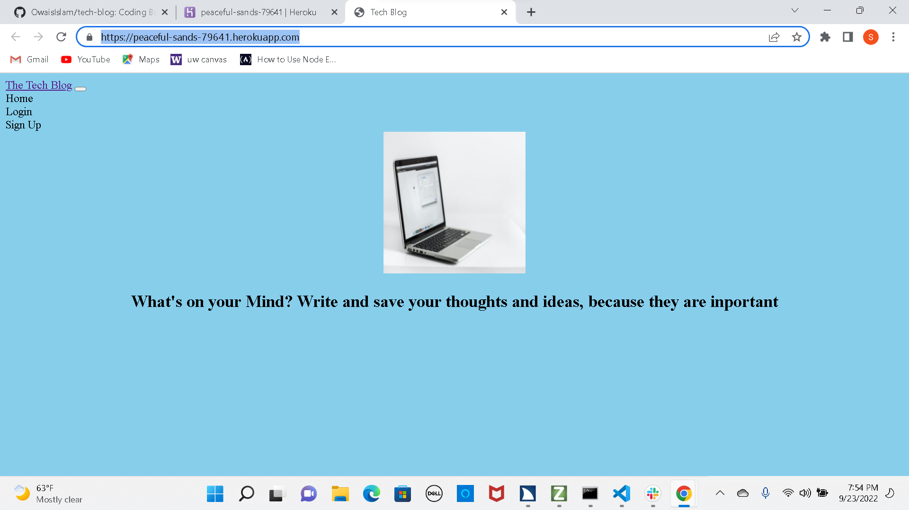
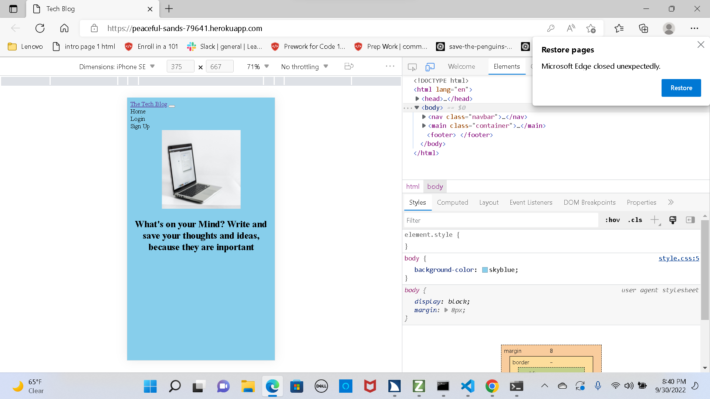

# MVC/ Tech_ Blog

## Description

This is a full stack application that allows various different users to create an account and post blog, add comments to posts, delete their own post.

## Table of Contents

- [Installation](#installation)
- [Usage](#usage)
- [License](#license)
- [Contribution](#contribution)
- [Tests](#test)
- [Questions](#questions)

## Installation

This application uses `node.js` and `express.js` to create a RESTful API. It also uses `bouncerjs` as a lightweight form validation library.
 The following npm dependencies will need to be installed:  
  `bcrypt:^5.0.0`
 `connect-session-sequelize: ^7.0.4`
 `dotenv: ^8.2.0`
 `express: ^4.17.1`
 `express-handlebars: ^5.2.0`
 `express-session: ^1.17.1`
 `formbouncerjs: ^1.4.6`
 `mysql2: ^2.2.5`
 `sequelize: ^6.3.5`

## License

  This application is licensed under [GNU](https://www.gnu.org/licenses/licenses.en.html).

## Contribution

University of Washington coding bootcamp challenge 14 project:

## Test

To test this project, please clone the repo and install the necessary npm dependencies.
  For code review go to the [Github  repo](https://github.com/teshome28sara/Tech_Blog)
 For deployed site go to  [Tech Blog](https://peaceful-sands-79641.herokuapp.com/)

## Questions
 tes28sar@gmail.com 

 ###  Desktop  Screenshot

 

 ### Moble  Screenshot

 

 <!-- test -->
 

